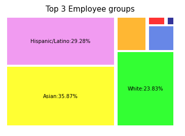

Utilize Data Science to feed the curiosity  
[Project 1: Santa Clara County Workforce](https://github.com/ChantieSophia/scc-employee)  
Language: Python  
Tools: Pandas, Numpy, Matplotlib.pyplot, Seaborn, Socrata   
* Almost 36% of the employees are Asian, 29% Hispanic and then followed by White employees, 24%. 

* Among all the job categories, professionals, administrative support, protective service workers and technicians are the biggest groups. Asian employees dominiate professionals and Technicians job categories while, Hispanic employees dominate in job categories of Administrative Support and Protective Service Workers. 

* In all the departments, most of the Asian employees work in Santa Clara Valley Med Center, same as Hispanic and White employee. Compared with Asian and White employees, there is a higher percentage of Hispanic employees work in the social services agency. 

* As the results of Chi-square test, both results are significant, meaning there are associations between ethnicity and job cateogry and department respectively. However since the categories may not be completely independent from each other which violates the assumptions, we can not draw the conclusions that the association is actually there.  

[Project 2: Santa Clara County Crime Reports](https://github.com/ChantieSophia/scc-crime-reports)  
Language: Python  
Tools: Pandas, Numpy, Matplotlib.pyplot, Seaborn, Socrata, Skitlearn  
* Overall trend for the number of crime reports is going down since 2020.

* Different type of crime reports have different distribution over the day. For total cases of all types, the number of crime reports goes up starts from 5-6 in the morning and flutuates a little and starts going down from 8-9 in the evening.

* The regression model I built is 78% acurate in prediction. There is a lot room to improve the accuracy by introducing more variables, for instance, the type of the crime report, etc,, which we will cover in future project.  

[Project 3: 2016 presidential candidates spending](https://github.com/ChantieSophia/2016-president-candidates-spending.git)  
Language: Python, SQL 
Tools: pandsql, googlesearch  
* data wrangling by adding back Party data for each candidate 
Before - missing canndidate party data in column Paty, wrong data format in column dist_dt 

 
After - anndidate party data, data format corrected 

 
* table transformation: added rolling total and rank columns 

[Project 4: basic portfolio website](https://chantiesophia.github.io/)  
Language: HTML, CSS 
